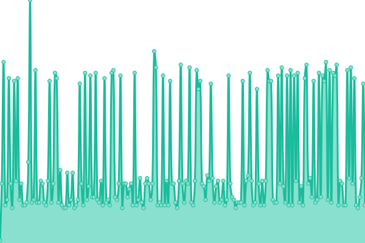
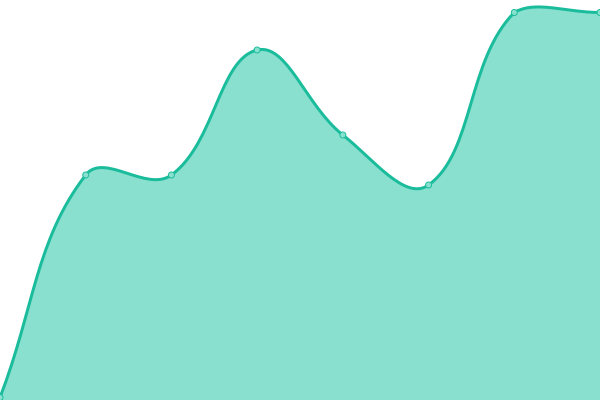

# [📈 Live Status](https://cake-tech.github.io/upptime): <!--live status--> **🟧 Partial outage**

This repository contains the open-source uptime monitor and status page for [Cake Labs LLC](cakewallet.com), powered by [Upptime](https://github.com/upptime/upptime).

With [Upptime](https://upptime.js.org), you can get your own unlimited and free uptime monitor and status page, powered entirely by a GitHub repository. We use [Issues](https://github.com/cake-tech/upptime/issues) as incident reports, [Actions](https://github.com/cake-tech/upptime/actions) as uptime monitors, and [Pages](https://cake-tech.github.io/upptime) for the status page.

<!--start: status pages-->
<!-- This summary is generated by Upptime (https://github.com/upptime/upptime) -->
<!-- Do not edit this manually, your changes will be overwritten -->
<!-- prettier-ignore -->
| URL | Status | History | Response Time | Uptime |
| --- | ------ | ------- | ------------- | ------ |
|  [xmr-node.cakewallet.com:18081](xmr-node.cakewallet.com) | 🟩 Up | [xmr-node-cakewallet-com-18081.yml](https://github.com/cake-tech/upptime-monerocom/commits/HEAD/history/xmr-node-cakewallet-com-18081.yml) | 

 30ms
     
 | 

<a href="https://nodes.monero.com/history/xmr-node-cakewallet-com-18081">89.58%</a>
    

|  cakexmrl7bonq7ovjka5kuwuyd3f7qnkz6z6s6dmsy3uckwra7bvggyd.onion:18081 | 🟩 Up | [cakexmrl7bonq7ovjka5kuwuyd3f7qnkz6z6s6dmsy3uckwra7bvggyd-onion-18081.yml](https://github.com/cake-tech/upptime-monerocom/commits/HEAD/history/cakexmrl7bonq7ovjka5kuwuyd3f7qnkz6z6s6dmsy3uckwra7bvggyd-onion-18081.yml) | 

 160ms
     
 | 

<a href="https://nodes.monero.com/history/cakexmrl7bonq7ovjka5kuwuyd3f7qnkz6z6s6dmsy3uckwra7bvggyd-onion-18081">100.00%</a>
    

|  [node.sethforprivacy.com:18089](node.sethforprivacy.com) | 🟩 Up | [node-sethforprivacy-com-18089.yml](https://github.com/cake-tech/upptime-monerocom/commits/HEAD/history/node-sethforprivacy-com-18089.yml) | 

 60ms
     
 | 

<a href="https://nodes.monero.com/history/node-sethforprivacy-com-18089">100.00%</a>
    

|  [nodes.hashvault.pro:18081](nodes.hashvault.pro) | 🟩 Up | [nodes-hashvault-pro-18081.yml](https://github.com/cake-tech/upptime-monerocom/commits/HEAD/history/nodes-hashvault-pro-18081.yml) | 

 127ms
     
 | 

<a href="https://nodes.monero.com/history/nodes-hashvault-pro-18081">99.30%</a>
    

|  [node.c3pool.com:18081](node.c3pool.com) | 🟥 Down | [node-c3pool-com-18081.yml](https://github.com/cake-tech/upptime-monerocom/commits/HEAD/history/node-c3pool-com-18081.yml) | 

 0ms
     
 | 

<a href="https://nodes.monero.com/history/node-c3pool-com-18081">0.00%</a>
    

|  [node.community.rino.io:18081](node.community.rino.io) | 🟩 Up | [node-community-rino-io-18081.yml](https://github.com/cake-tech/upptime-monerocom/commits/HEAD/history/node-community-rino-io-18081.yml) | 

 117ms
     
 | 

<a href="https://nodes.monero.com/history/node-community-rino-io-18081">100.00%</a>
    

|  [node.moneroworld.com:18089](node.moneroworld.com) | 🟩 Up | [node-moneroworld-com-18089.yml](https://github.com/cake-tech/upptime-monerocom/commits/HEAD/history/node-moneroworld-com-18089.yml) | 

 73ms
     
 | 

<a href="https://nodes.monero.com/history/node-moneroworld-com-18089">100.00%</a>
    

<!--end: status pages-->

[**Visit our status website →**](https://cake-tech.github.io/upptime)

## 📄 License

- Powered by: [Upptime](https://github.com/upptime/upptime)
- Code: [MIT](./LICENSE) © [Cake Labs LLC](cakewallet.com)
- Data in the `./history` directory: [Open Database License](https://opendatacommons.org/licenses/odbl/1-0/)
